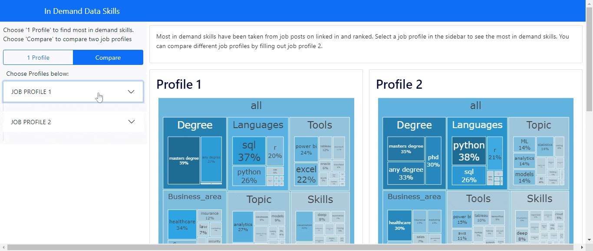

<!-- Add banner here -->


# Popular Data skills
## Overview 
Run an interactive dashboard to find the most in demand data skills take from linked in job listing.
The dashboard is interactive and filterable enter your job profile find most in demand skills and compare then to another job profile.

You can visit my working [DASHBOARD HERE](https://popular-data-skills-dashboard.herokuapp.com)!
*Please be aware it may take a few minutes to load initially. It's on Heroku.*

<!-- Badges -->


# Project Description
Starting out in a data role can be difficult there are so many languages and skills to learn.
Every tool comes with advantages and disadvantages.  Knowing what to focus and learn can be difficult.
There are thousands of videos and courses with contradicting inforamtion.
As the end goal is to become employed. Why not let your potential employers tell you what to learn.

Enter your job profile (job, experience, degree) and this dashboard filters linked in job posts relevant to your job profile.
Then it provides the most in demand skills mentioned in those posts.
You can also compare your job profile with a second profile. You can compare profiles to see what skills you need to level up.
If i change from analyst to scientist, what skills i need to learn now for the future.


## Preview


# Table of contents
- [Project Title](#popular-data-skills)
- [Preview](#preview)
- [Table of contents](#table-of-contents)  
- [Installation](#installation)
- [Usage](#usage)
- [Exploratory Analysis](#exploratory-analysis)  
- [Development](#development)
- [Contribute](#contribute)
    - [Adding new features or fixing bugs](#adding-new-features-or-fixing-bugs)
- [License](#license)


# Installation
[(Back to top)](#table-of-contents)  
To use this project, first clone the repo on your device using the command below:

```cd <project_folder>```  # Go to new project folder  
```python3 -m venv my_venv``` # If not created, create virtualenv  
```source ./my_venv/bin/activate``` # Activate virtualenv  
```git init``` # Initiate GitHub Repo  
```git clone https://github.com/aharris86/popular_data_skills.git``` # Clone project repository  
```pip3 install -r ./requirements.txt``` # Install dependencies
For more information on cloning a repo look at
[this thread](https://stackoverflow.com/questions/60719286/actions-for-creating-venv-in-python-and-clone-a-git-repo)
on Stack Overflow.

# Usage
[(Back to top)](#table-of-contents)  
### Dashboard
Run the main.py script in the root folder.
### Webscraper
First enter your linked in username and password in the [config folder.](popular_data_skills/config)  
Next run the web_scrapers_linkedin_scraper.py  

# Exploratory Analysis
[(Back to top)](#table-of-contents)  
See seperate analysis [README HERE](popular_data_skills/exploratory_analysis)  

# Development
[(Back to top)](#table-of-contents)

Selenium and Beautiful soup are used to scrape linked in job listings for relevant job posts, which are then saved.
The scraped data is wrangled into a data frame. A seperate custom  keywords module has two structures on lists all
keywords in a dictionary with a list of similar words as values. The next collects all keyords into group with groups as keys and
lists of keywords as values. Each job post is search to return if the keyword is present.
This dataframe is then filtered by the job profile variables and each skill is summed.

# Contribute
[(Back to top)](#table-of-contents)  
 
View our [contribution guidelines here](popular_data_skills/.github/ISSUE_TEMPLATE/contributing.md)

## Adding new features or fixing bugs
We would love any help or advice you have.   
See the links below if you would like to contribute:  
[Report a bug](popular_data_skills/.github/ISSUE_TEMPLATE/bug_report)  
[Feature Request](popular_data_skills/.github/ISSUE_TEMPLATE/feature-request)  
[Pull Request](popular_data_skills/.github/ISSUE_TEMPLATE/pull_request)  

## Future works
Automate web scrapers - allows periodic update of job listings  
Add wages information for each job profile   
Add more jobs to selection - data engineer, junior roles ect  
Scrape more sites - Indeed, glassdoor etc   

# License
### [MIT License](https://github.com/aharris86/popular_data_skills/blob/master/LICENCE.md)

## Contact me 
<div align="center">

Email: arwharris86@gmail.com  
Website:  https://aharris86.github.io  
Linked in: https://www.linkedin.com/in/adam-harris-data  

</div>
